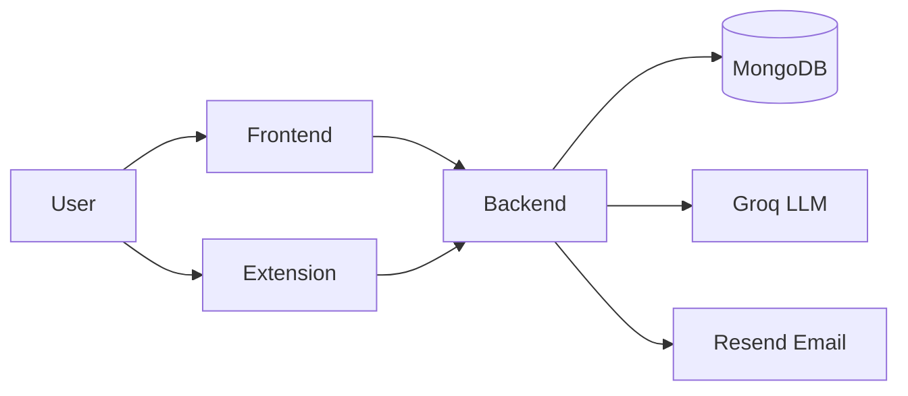

# TrackMyHunt

TrackMyHunt is a job-search and application management platform for students and job seekers. It combines a web workspace for tracking applications, planning opportunities, and preparing for interviews with an AI resume analyzer and a browser extension that captures jobs directly from job portals.

## Overview

Job hunting usually means scattered spreadsheets, forgotten follow-ups, and resumes that never get checked against the actual job description. TrackMyHunt solves this with one connected system:

- **Web app** — dashboard, application pipeline, resume tools, and preparation workspace.
- **AI Resume & JD Analyzer** — upload a resume PDF, paste a job description, get an explainable match report.
- **Chrome extension** — detects the job on the open tab and saves it to the dashboard in one click.

## Core Features

| Area | What it does |
|---|---|
| Dashboard | Application metrics, pipeline overview, upcoming items |
| Application Tracker | Full CRUD for applications: company, role, type, status, links, notes, dates, per-status details, timeline, detail pages |
| Kanban Pipeline | Drag-and-drop board across 7 stages: Applied, Resume Shortlisted, OA Done, Interview Scheduled, Interview Done, Rejected, Other |
| Opportunity Planner | Upcoming roles, deadlines, and next actions |
| Skillboard | Self-assessed skills mapped against target-role requirements |
| Resources Hub | Saved prep links, guides, and references |
| Notes | Interview notes, takeaways, and daily reminders |
| Resume Manager | URL/link-based resume version organizer (links only, no file storage) |
| AI Resume & JD Analyzer | Resume PDF + job description → match score, category breakdown, matched skills, missing must-have skills, improvements, final recommendation. Scoring is deterministic and computed backend-side; the model only extracts evidence |
| Email Reminders | Opt-in follow-up digests and interview reminders sent via Resend (`npm run reminders` on a schedule) |
| Chrome Extension | Side-panel job capture for LinkedIn, Indeed, Naukri, Internshala, Greenhouse, Lever, Workday, Ashby, Wellfound, Google Forms, and generic pages; backend duplicate detection prevents double saves |
| Authentication | Email + OTP verification, Google OAuth sign-in, JWT sessions |

## How It Works

```
User
 ↓
TrackMyHunt Web App ──→ manage applications, resumes, preparation
 ↓
Browser Extension ──→ detect job on open tab ──→ save to TrackMyHunt
 ↓
Track application progress on dashboard / Kanban
```

AI Analyzer flow (separate, no Resume Manager dependency):

```
Resume PDF upload + pasted Job Description
 ↓
PDF text extraction + normalization
 ↓
Groq (openai/gpt-oss-120b) extracts requirements + evidence (temperature 0)
 ↓
Backend validates output, computes weighted score deterministically
 ↓
Match report (results cached by content hash, per user)
```

## Architecture



```text
TrackMyHunt/
├── frontend/     React 19 + Vite + Tailwind CSS 4 + React Router 7
├── backend/      Node.js + Express 5 + Mongoose 9 (MongoDB)
└── extension/    Chrome MV3 side panel (React + Vite + @crxjs/vite-plugin)
```

## Tech Stack

| Layer | Technology | Version |
|---|---|---|
| Frontend core | React + React DOM + Vite | `^19.1.1` / `^7.1.7` |
| Styling | Tailwind CSS | `^4.1.16` |
| Routing | react-router-dom | `^7.9.5` |
| Icons | lucide-react | `^0.552.0` |
| OAuth client | @react-oauth/google | `^0.13.4` |
| Backend core | Express | `^5.2.1` |
| Database ODM | Mongoose (MongoDB) | `^9.1.5` |
| Auth | jsonwebtoken, bcrypt, google-auth-library | `^9.0.3` / `^6.0.0` / `^10.5.0` |
| AI provider | groq-sdk (`openai/gpt-oss-120b`) | `^1.6.0` |
| Email | resend | `^6.28.1` |
| Uploads / parsing | multer, pdf-parse, mammoth, validator | `^2.4.0` / `^2.4.5` / `^1.12.3` / `^13.15.35` |
| Extension build | @crxjs/vite-plugin, Tailwind CSS 3, oxlint | `^2.0.0` / `^3.4.19` / `^1.71.0` |

## Project Structure

```text
backend/
  app.js server.js          Express app + entry point
  config/ routes/           Route mounting, DB connection
  controllers/ services/    Request handlers + business logic
  models/ middleware/ utils/
  templates/                Resend HTML email templates
  scripts/send-reminders.js Reminder cron entry point
  tests/                    node:test suites (reminder, email, AI, upload, extract)
frontend/
  src/pages/                Landing, Auth, Dashboard, Applications, AiAnalyzer, …
  src/components/           UI kit, landing sections, application widgets
  vercel.json               SPA rewrite for deployment
extension/
  src/                      Side panel UI, background worker, content scripts
  src/content/extract/      Layered extraction engine (platform → JSON-LD → meta → heuristics)
  src/content/scrapers/     Per-platform extractors (11 platforms + generic)
  test/                     Offline extractor tests (synthetic DOM fixtures)
  manifest.json             MV3: side panel, content scripts, host permissions
```

## Getting Started

Prerequisites: Node.js 18+, a MongoDB database (Atlas or local), a Groq API key, a Resend API key (for emails), a Google OAuth client ID (for Google sign-in).

```sh
# Backend (http://localhost:3000)
cd backend
npm install
cp .env.example .env   # then fill in values (see below)
npm run dev

# Frontend (http://localhost:5173)
cd frontend
npm install
npm run dev

# Extension (load unpacked)
cd extension
npm install
npm run build
# Chrome → Extensions → Developer mode → Load unpacked → extension/dist/
```

## Environment Variables

Backend (`backend/.env`, see `.env.example` — never commit `.env`):

| Variable | Purpose |
|---|---|
| `DATABASE_URL` | MongoDB connection string |
| `JWT_SECRET` | JWT signing secret |
| `CLIENT_URL` / `PORT` | Frontend origin / server port |
| `GOOGLE_CLIENT_ID` | Google OAuth client ID |
| `groq_api_key` | Groq key for the AI Analyzer |
| `RESEND_API_KEY`, `RESEND_FROM_EMAIL`, `RESEND_FROM_NAME` | Reminder/OTP emails |
| `EMAIL_USER`, `EMAIL_PASS`, `EMAIL_FROM` | Legacy SMTP settings |

Frontend (`frontend/.env`):

| Variable | Purpose |
|---|---|
| `VITE_BASE_BACKEND_URL` | Backend API base URL |
| `VITE_GOOGLE_CLIENT_ID` | Google OAuth client ID (public) |

Extension (`extension/.env`, URLs only — no secrets):

| Variable | Purpose |
|---|---|
| `VITE_BASE_BACKEND_URL` | Backend API base URL |
| `VITE_BASE_FRONTEND_URL` | Dashboard origin for token sync |

## Scripts & Testing

| Package | Command | Purpose |
|---|---|---|
| backend | `npm test` | All suites: reminders, email templates, resume extraction, AI analyzer, AI upload — offline, `node:test`, no network |
| backend | `npm run reminders` | Run one reminder cycle (schedule via cron) |
| backend | `npm run dev` / `npm start` | Dev (nodemon) / production server |
| frontend | `npm run build`, `npm run lint` | Production build, ESLint |
| extension | `npm run build`, `npm run lint`, `npm test` | CRX build, oxlint, offline extractor tests |

## API Overview

All routes live under `/api` and (except auth + health check) require `Authorization: Bearer <JWT>`:

| Prefix | Resource |
|---|---|
| `/api/auth` | Signup, OTP verify/resend, login, Google login |
| `/api/user` | Profile, reminder settings |
| `/api/applications` | Application CRUD, detail timeline, duplicate-checked create |
| `/api/opportunities`, `/api/skills`, `/api/resources`, `/api/notes` | Planner, skillboard, resources, notes |
| `/api/resumes` | Link-based resume records |
| `/api/dashboard` | Aggregated dashboard metrics |
| `/api/ai/analyze` | Resume PDF + JD → structured analysis (multipart upload, 5 MB limit) |

## Deployment Notes

- **Frontend** ships with `vercel.json` SPA rewrites (`/` → `index.html`).
- **Backend** runs with `node server.js` (`PORT` env-driven); schedule `npm run reminders` externally for emails.
- **Extension** is unpacked distribution: `npm run build` → load `extension/dist/` in Chrome developer mode.

## Screenshots

- `frontend/src/assets/image.png` — dashboard preview used in the landing hero.
- `frontend/src/assets/dashboardpreview2.png` — dashboard preview used in the extension showcase section.
