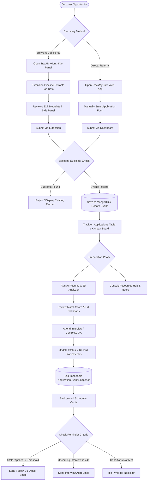
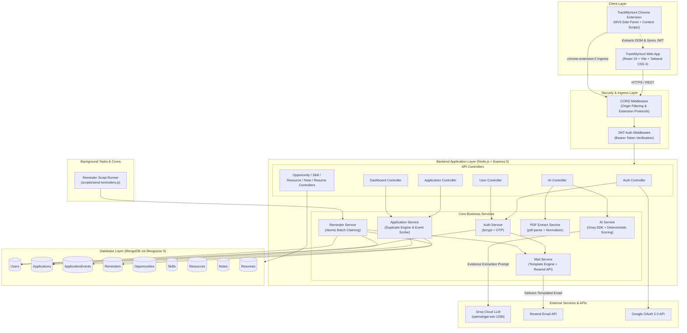
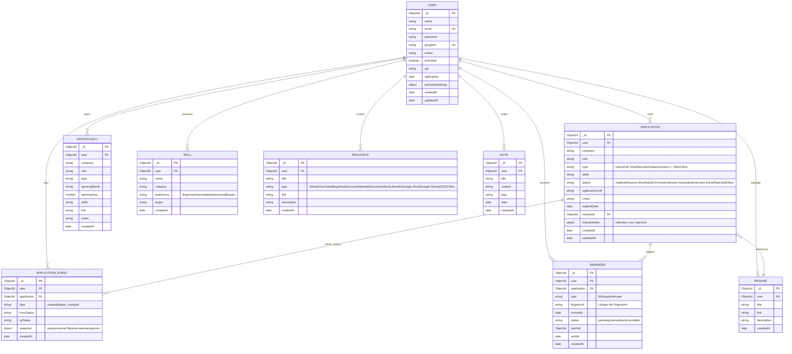
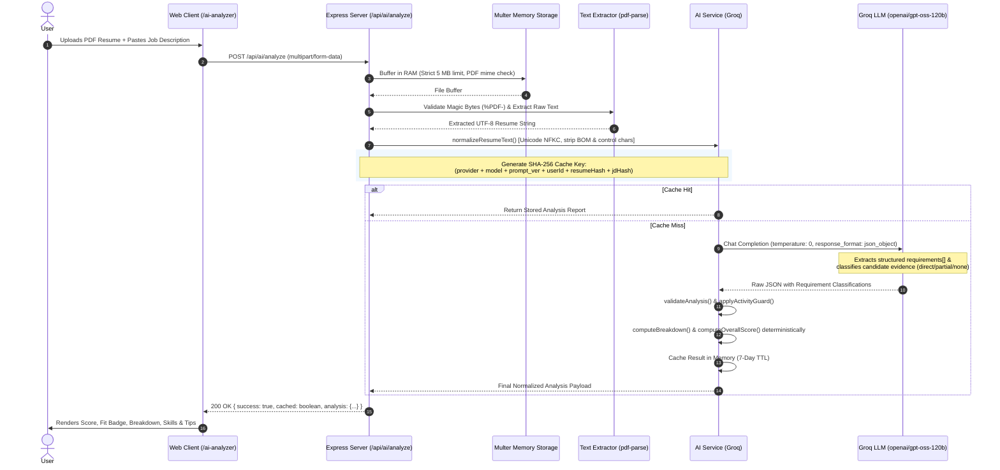

# TrackMyHunt

TrackMyHunt is an end-to-end job search management and application tracking platform designed for students, new graduates, and active job seekers. It centralizes fragmented job-hunting activities into a unified workspace, providing full-lifecycle application management, interview timeline tracking, future opportunity planning, skill gap organization, interview notes, link-based resume cataloging, and an explainable AI Resume and Job Description Analyzer. The platform is paired with a companion Chrome extension that extracts structured job postings directly from portal tabs and saves them to the central dashboard with duplicate detection.

---

## 1. Product Overview

### Problem Statement
During an active job hunt, candidates track dozens or hundreds of positions across disparate channels (job boards, company career portals, referrals, and campus drives). This leads to:
- Disorganized spreadsheets with missing metadata, broken links, and outdated statuses.
- Missed follow-ups and uncoordinated interview preparation.
- Submitting generic resumes that fail to address explicit job description requirements.
- Redundant manual data entry when transitioning between job boards and tracking sheets.

### Target Audience
- Students and new graduates seeking internships and entry-level positions.
- Software engineers and technology professionals managing multi-stage technical interview loops.
- Career changers and active job seekers who require structured organization for high-volume outreach.

### System Solution
TrackMyHunt addresses these friction points through two tightly coupled components:
1. **TrackMyHunt Web Application**: A centralized productivity dashboard providing CRUD operations for job applications, visual Kanban pipeline management, interview timeline history, proactive opportunity scheduling, skill tracking, curated resources, markdown-capable notes, link-based resume organization, and an automated background reminder subsystem. It also hosts the AI Resume & JD Analyzer.
2. **TrackMyHunt Browser Extension**: A Manifest V3 companion side panel that parses active job portal web pages in real time via a layered extraction engine, extracts structured role metadata, flags duplicate applications against the backend, and syncs directly into the user's dashboard.

---

## 2. Features

### Authentication and Account Security
- **Email & Password Authentication**: Registration secured with bcrypt password hashing and mandatory 6-digit OTP verification delivered via email.
- **OTP Verification & Resend**: Time-limited verification codes (10-minute expiry) for account verification and password resets.
- **Google OAuth 2.0**: Direct sign-in using Google identity tokens verified server-side with `google-auth-library`.
- **JWT Session Management**: Signed JSON Web Tokens (30-day validity) transmitted via `Authorization: Bearer` headers across protected REST endpoints.
- **Account Management**: Self-service profile updates, password changes, and complete account deletion with cascading cleanups.

### Centralized Dashboard
- **Aggregate Metrics**: Real-time counter metrics tracking Total Applications, Active/Pending Applications, Interviews (Scheduled & Completed), and Rejections.
- **Recent Pipeline Activity**: Direct feed of the 5 most recently updated applications with current stage indicators.
- **Upcoming Opportunities**: Priority listing of upcoming hiring cycles mapped from the Opportunity Planner.
- **Skill Proficiency Distribution**: Dynamic breakdown of tracked skills grouped by proficiency level (Beginner, Intermediate, Advanced, Expert).

### Application Tracking & Pipeline Management
- **Full Application Lifecycle Tracking**: Records company name, job role, employment type (`Intern`, `Full-Time`, `Remote`, `Freelance`, `Intern + Offer`, `Other`), skills required, application link, notes, and application date.
- **Status Management**: Supports seven workflow statuses: `Applied`, `Resume Shortlisted`, `OA Done`, `Interview Scheduled`, `Interview Done`, `Rejected`, and `Other`.
- **Kanban Board**: Drag-and-drop board for visual stage transitions with status-specific metadata prompts.
- **Application Detail View & Timeline**: Dedicated route (`/applications/:id`) displaying application metadata, mapped resume links, and an immutable event timeline tracking each status transition snapshot.
- **Status Details Capture**: Context-sensitive fields for specific stages:
  - *Interview*: Date, time, interview type (`Technical`, `HR`, `Behavioral`, `Managerial`, `Other`), meeting link, and preparation notes.
  - *Online Assessment (OA)*: Completion/due date, assessment portal link, and notes.
  - *Rejection*: Rejection date and optional feedback/reason.
- **Duplicate Application Prevention**: Backend checks compare incoming submissions against existing applications using normalized job URLs or normalized company and role combinations to prevent redundant records.

### Opportunity Planner
- **Forward-Looking Pipeline**: Track prospective openings and upcoming company hiring windows before formal applications open.
- **Timeline Organization**: Filter and sort planned opportunities by opening month, opening year, target role, and employment type.

### Skillboard
- **Competency Inventory**: Self-assessed skills directory categorized by functional domain (e.g., Frontend, Backend, Database, Core CS, Soft Skills).
- **Proficiency Levels**: Structured categorization across `Beginner`, `Intermediate`, `Advanced`, and `Expert`.
- **Target Role Alignment**: Explicit mapping of individual skills to target job titles.

### Resources Hub
- **Curated Knowledge Repository**: Organize preparation materials, articles, interview cheat sheets, repositories, and documentation.
- **Multi-Category Tagging**: Classify resources by type (`GitHub`, `YouTube`, `Blog`, `Article`, `Course`, `Website`, `Documentation`, `LinkedIn`, `Google Drive`, `Google Sheets`, `PDF`, `Other`).

### Notes & Brain Dump
- **Interview & Preparation Notes**: Timestamped markdown-ready scratchpad for recording technical question breakdowns, interview retrospectives, recruiter correspondence, and daily agendas.
- **Tagging & Filtering**: Searchable multi-tag categorization for fast retrieval.

### Resume Manager
- **Link-Based Version Catalog**: Organize resume variations tailored to specific niches (e.g., Full-Stack, Backend, Systems, Internship) using external links (Google Drive, Dropbox, Notion, personal portfolio).
- **Application Association**: Associate specific resume versions with individual job applications without storing binary files in the database.

### AI Resume & JD Analyzer
- **Direct PDF Parsing**: Memory-only PDF upload (up to 5 MB) validated against magic bytes (`%PDF-`) and extracted using `pdf-parse` without persisting raw files to disk or database.
- **LLM Evidence Extraction**: Leverages Groq API running `openai/gpt-oss-120b` at `temperature: 0` to extract explicit factual evidence from the resume against JD requirements.
- **Deterministic Scoring Engine**: Category scores, overall match score (0-100), and fit levels (`Strong Fit`, `Moderate Fit`, `Low Fit`, `Not a Fit`) are calculated deterministically on the backend from extracted evidence, ensuring consistent and explainable results.
- **Actionable Feedback**: Generates matched skills (up to 10), critical missing must-have requirements (up to 5), good-to-have improvement recommendations (up to 8), an executive summary, and an actionable final recommendation.
- **SHA-256 Caching**: Analyses are hashed and cached per user, resume text content, normalized job description, and prompt version to eliminate redundant API calls.

### Automated Email Reminders
- **Proactive Notifications**: Scheduled background engine running through external cron triggers (`npm run reminders`).
- **Follow-up Digests**: Automated emails alerting candidates to applications lingering in `Applied` status beyond a configured day threshold (default: 7 days, minimum pending batch size: 3).
- **Interview Alerts**: Automated reminders dispatched 24 hours prior to scheduled interview timestamps.
- **Idempotent Batch Protocol**: Reminders use atomic batch claiming (`batchId`) and unique compound index fingerprints (`date|time|type|link`) to guarantee zero duplicate emails across overlapping scheduler runs.
- **Template Delivery**: Branded, responsive HTML templates delivered via Resend API.
- **User Configurable**: Opt-in toggles and thresholds managed via user profile settings.

### Companion Browser Extension
- **Chrome Manifest V3**: Side-panel extension running on Chrome 116+ that detects job postings on the active browser tab.
- **Layered Multi-Tier Scraping**: Cascading pipeline combining platform scrapers, JSON-LD structured data, OpenGraph metadata, and DOM heuristics.
- **Supported Job Platforms**: Specialized scrapers for LinkedIn, Indeed, Naukri, Internshala, Greenhouse, Lever, Workday, Ashby, Google Forms, and generic career pages.
- **Silent Token Synchronization**: Secure background JWT synchronization with the active TrackMyHunt web app session via local content scripts.

---

## 3. Product Workflow



### Typical Usage Cycle
1. **Discovery & Capture**: The candidate discovers an opening on LinkedIn, Indeed, or an ATS board. Opening the TrackMyHunt extension side panel automatically extracts the company, role title, job location, work mode, employment type, and posting URL.
2. **Review & Ingestion**: The candidate confirms or edits details in the extension side panel and submits. The backend verifies that the normalized URL or company/role combination does not already exist for that user.
3. **Targeted Preparation**: The candidate visits `/ai-analyzer`, uploads their target resume PDF, and pastes the job description. The analyzer provides an objective match score, pinpoints missing requirements, and provides actionable adjustment tips.
4. **Active Pipeline Tracking**: As the candidate progresses, they drag cards across the Kanban board or update status through the table view. When changing status to `Interview Scheduled`, `OA Done`, or `Rejected`, detailed modal inputs capture interview links, dates, times, and assessment notes.
5. **Timeline Auditing**: Each status modification writes a snapshot event to `ApplicationEvent`, allowing the candidate to review the complete progression history on the application detail page.
6. **Automated Follow-up Assistance**: If an application remains without response past the user's configured threshold, or when an interview is 24 hours away, the scheduled reminder daemon dispatches notification emails via Resend.

---

## 4. High-Level Architecture



---

## 5. Technology Stack

### Frontend Application
| Layer / Component | Technology | Version | Description |
|---|---|---|---|
| Core Framework | React | `^19.1.1` | Modern React architecture with functional components and hooks |
| Bundler & Tooling | Vite | `^7.1.7` | High-speed frontend development server and rollup packager |
| Styling & Theme | Tailwind CSS | `^4.1.16` | Utility-first CSS engine with dark/light mode context support |
| Application Routing | React Router DOM | `^7.9.5` | Client-side declarative routing and protected route wrappers |
| Iconography | Lucide React | `^0.552.0` | Comprehensive UI SVG icons |
| OAuth Integration | `@react-oauth/google` | `^0.13.4` | Google Identity Services integration for browser sign-in |
| Code Quality | ESLint | `^9.36.0` | Modern flat-config linting suite |

### Backend API Server
| Layer / Component | Technology | Version | Description |
|---|---|---|---|
| Runtime Environment | Node.js | `>= 18.0.0` | Server-side JavaScript execution environment |
| Web Application Framework | Express | `^5.2.1` | Next-generation Express web framework |
| Object-Document Mapper | Mongoose | `^9.1.5` | Strict schema modeling and validation for MongoDB |
| Password Security | bcrypt | `^6.0.0` | Cryptographic hashing for user password credentials |
| Token Management | jsonwebtoken | `^9.0.3` | HMAC-SHA256 stateless session tokens |
| OAuth Verification | google-auth-library | `^10.5.0` | Server-side cryptographic verification of Google ID tokens |
| AI Integration | groq-sdk | `^1.6.0` | Client for Groq high-speed LLM inference endpoint |
| Email Delivery | resend | `^6.28.1` | Developer-first transactional email delivery API |
| File Handling | multer | `^2.4.0` | Memory storage upload middleware for resume PDF payloads |
| PDF Text Extraction | pdf-parse | `^2.4.5` | Buffer-based binary text extractor for uploaded PDF resumes |
| Input Validation | validator | `^13.15.35` | String sanitization and RFC-compliant email verification |
| Cookie Parsing | cookie-parser | `^1.4.7` | HTTP request cookie parsing utility |

### Browser Extension
| Layer / Component | Technology | Version | Description |
|---|---|---|---|
| Extension Specification | Chrome Manifest V3 | MV3 | Chrome extension standard using Background Service Workers |
| User Interface | React + Vite | `^19.2.7` / `^8.1.1` | Side panel SPA UI using modern React |
| Extension Plugin | `@crxjs/vite-plugin` | `^2.0.0` | Vite plugin for Chrome Manifest V3 integration |
| Styling | Tailwind CSS | `^3.4.19` | Extension side panel styling engine |
| Static Analysis | oxlint | `^1.71.0` | High-performance Rust-based JavaScript linter |

---

## 6. Database Models & Schema Design

All application entities are modeled using Mongoose schemas on MongoDB:



---

## 7. AI Resume & JD Analyzer Pipeline

The AI Resume & JD Analyzer operates through an isolated, deterministic pipeline:



### Deterministic Scoring Guarantees
- **No LLM Score Hallucination**: The LLM is strictly instructed *never* to generate an overall numerical score. It acts exclusively as an evidence mapper, extracting material requirements and classifying them as `direct`, `partial`, or `none`.
- **Backend Math**: The overall score (0–100) is derived from category weights (Skills Technical Match, Role Relevance, Experience, Education, and Domain Alignment).
- **Activity Guard**: Routine daily activities (e.g., "attending team standups") are guarded to prevent penalizing candidates if unmentioned in the resume.
- **Privacy & Memory Lifecycle**: Uploaded PDF files are never written to disk, never uploaded to S3/Cloudinary, and never retained in the database. Once the request finishes, the file buffer is discarded by the garbage collector.

---

## 8. Email Reminders & Background Subsystem

TrackMyHunt features an opt-in reminder subsystem that tracks stale applications and upcoming interviews.

```mermaid
flowchart TD
    Start([Cron Trigger: npm run reminders]) --> ConnectDB[(Connect to MongoDB)]
    ConnectDB --> RunCycle[runReminderCycle]
    
    subgraph FollowupFlow["1. Follow-up Digest Cycle"]
        FindUsers1[Find Users with followupReminders Enabled] --> CheckApps[Find 'Applied' status applications older than threshold]
        CheckApps --> CheckEligible{Eligible count >= minPendingApplications?}
        CheckEligible -->|No| SkipFollowup[Skip User]
        CheckEligible -->|Yes| ClaimFollowup[Atomic Upsert 'pending' Reminder Markers]
        ClaimFollowup --> AtomicBatch1[Claim Markers with Run batchId]
        AtomicBatch1 --> RenderFollowup[Render followup-email.html]
        RenderFollowup --> SendFollowup[Deliver via Resend API]
        SendFollowup --> MarkSent1[Update Marker status: 'sent', sentAt: now]
    end

    subgraph InterviewFlow["2. Interview Reminder Cycle"]
        FindUsers2[Find Users with interviewReminders Enabled] --> CheckInterviews[Find 'Interview Scheduled' applications]
        CheckInterviews --> CalcDue{Due Window: Now <= InterviewTime <= Now + Hours?}
        CalcDue -->|No| SkipInterview[Skip Application]
        CalcDue -->|Yes| GenFingerprint[Generate Slot Fingerprint: date|time|type|link]
        GenFingerprint --> ClaimInterview[Atomic Upsert 'pending' Marker]
        ClaimInterview --> AtomicBatch2[Claim Markers with Run batchId]
        AtomicBatch2 --> RenderInterview[Render interview-email.html]
        RenderInterview --> SendInterview[Deliver via Resend API]
        SendInterview --> MarkSent2[Update Marker status: 'sent', sentAt: now]
    end

    RunCycle --> FollowupFlow
    RunCycle --> InterviewFlow
    MarkSent1 --> Complete([Exit Process with Code 0])
    MarkSent2 --> Complete
```

### Reliability & Idempotency
- **Fingerprinted Slots**: Rescheduling an interview produces a new hash (`date|time|type|link`), invalidating stale markers and preventing missed alerts for updated slots.
- **Atomic Two-Phase Claims**: Reminders are first created in a `pending` state with unique compound constraints (`user + application + type + fingerprint`), then claimed using an atomic `batchId`. Only records owned by the active batch are emailed, completely eliminating race conditions.

---

## 9. REST API Specification

All protected endpoints require an `Authorization: Bearer <JWT>` header.

### Authentication Endpoints (`/api/auth`)
| Method | Endpoint | Auth | Description |
|---|---|---|---|
| `POST` | `/api/auth/signup` | Public | Register new user; dispatches verification OTP |
| `POST` | `/api/auth/verify-otp` | Public | Verify registration OTP; issues JWT token |
| `POST` | `/api/auth/resend-otp` | Public | Resend time-limited verification OTP email |
| `POST` | `/api/auth/login` | Public | Authenticate via email & password; issues JWT |
| `POST` | `/api/auth/google` | Public | Verify Google OAuth identity token; issues JWT |
| `POST` | `/api/auth/forgot-password` | Public | Request password reset OTP email |
| `POST` | `/api/auth/reset-password` | Public | Submit reset OTP and set new password |

### User Management (`/api/user`)
| Method | Endpoint | Auth | Description |
|---|---|---|---|
| `PUT` | `/api/user/profile` | Bearer | Update user display name and profile fields |
| `PUT` | `/api/user/password` | Bearer | Change account password (requires old password) |
| `DELETE` | `/api/user/account` | Bearer | Permanently delete account and all cascading data |
| `GET` | `/api/user/reminders` | Bearer | Fetch user reminder configuration & thresholds |
| `PUT` | `/api/user/reminders` | Bearer | Update reminder preferences & delivery limits |

### Job Applications (`/api/applications`)
| Method | Endpoint | Auth | Description |
|---|---|---|---|
| `GET` | `/api/applications` | Bearer | Fetch all applications for user, sorted by date |
| `POST` | `/api/applications` | Bearer | Create application with duplicate protection |
| `PUT` | `/api/applications/:id` | Bearer | Update application fields or status details |
| `DELETE` | `/api/applications/:id` | Bearer | Delete application and clean up reminders/events |
| `GET` | `/api/applications/:id/events` | Bearer | Retrieve immutable status history timeline events |

### Opportunity Planner (`/api/opportunities`)
| Method | Endpoint | Auth | Description |
|---|---|---|---|
| `GET` | `/api/opportunities` | Bearer | Fetch planned upcoming opportunities |
| `POST` | `/api/opportunities` | Bearer | Create new future opening record |
| `PUT` | `/api/opportunities/:id` | Bearer | Update planned opportunity fields |
| `DELETE` | `/api/opportunities/:id` | Bearer | Delete planned opportunity record |

### Skillboard (`/api/skills`)
| Method | Endpoint | Auth | Description |
|---|---|---|---|
| `GET` | `/api/skills` | Bearer | Fetch all self-assessed skills |
| `POST` | `/api/skills` | Bearer | Add a skill with proficiency rating and target |
| `PUT` | `/api/skills/:id` | Bearer | Modify skill rating or target role |
| `DELETE` | `/api/skills/:id` | Bearer | Delete skill record |

### Resources Hub (`/api/resources`)
| Method | Endpoint | Auth | Description |
|---|---|---|---|
| `GET` | `/api/resources` | Bearer | Fetch saved reference links and study materials |
| `POST` | `/api/resources` | Bearer | Add resource with category type and link |
| `PUT` | `/api/resources/:id` | Bearer | Update resource metadata |
| `DELETE` | `/api/resources/:id` | Bearer | Delete resource entry |

### Notes (`/api/notes`)
| Method | Endpoint | Auth | Description |
|---|---|---|---|
| `GET` | `/api/notes` | Bearer | Retrieve preparation notes and brain dump entries |
| `POST` | `/api/notes` | Bearer | Create timestamped note with tags |
| `PUT` | `/api/notes/:id` | Bearer | Edit note title, content, or tags |
| `DELETE` | `/api/notes/:id` | Bearer | Delete note entry |

### Resume Manager (`/api/resumes`)
| Method | Endpoint | Auth | Description |
|---|---|---|---|
| `GET` | `/api/resumes` | Bearer | List saved resume links and descriptions |
| `POST` | `/api/resumes` | Bearer | Add external resume link (e.g. Google Drive) |
| `PUT` | `/api/resumes/:id` | Bearer | Update resume title, link, or description |
| `DELETE` | `/api/resumes/:id` | Bearer | Delete resume reference |

### Dashboard Aggregations (`/api/dashboard`)
| Method | Endpoint | Auth | Description |
|---|---|---|---|
| `GET` | `/api/dashboard` | Bearer | Aggregated counts, recent 5 apps, upcoming roles |

### AI Analysis (`/api/ai`)
| Method | Endpoint | Auth | Description |
|---|---|---|---|
| `POST` | `/api/ai/analyze` | Bearer | Multipart upload (`resumePdf` + `jobDescription`) |

---

## 10. Environment Variables

### Backend Configuration (`backend/.env`)
| Variable | Required | Description |
|---|---|---|
| `PORT` | Optional | HTTP port for Express server (Default: `5000`) |
| `CLIENT_URL` | Required | Allowed frontend client origin for CORS |
| `DATABASE_URL` | Required | MongoDB connection string (Atlas or local instance) |
| `JWT_SECRET` | Required | Cryptographic secret for signing JWT sessions |
| `GOOGLE_CLIENT_ID` | Optional | Google Cloud OAuth 2.0 client ID for token verification |
| `RESEND_API_KEY` | Optional | API key for transactional emails via Resend |
| `RESEND_FROM_EMAIL` | Optional | Verified sender email address in Resend |
| `RESEND_FROM_NAME` | Optional | Sender display name (e.g., `TrackMyHunt`) |
| `groq_api_key` | Optional | Groq Cloud API key for AI Resume Analyzer |

### Frontend Configuration (`frontend/.env`)
| Variable | Required | Description |
|---|---|---|
| `VITE_BASE_BACKEND_URL` | Required | Base URL of the backend API (e.g. `http://localhost:5000`) |
| `VITE_GOOGLE_CLIENT_ID` | Optional | Public Google OAuth client ID for web login button |

### Extension Configuration (`extension/.env`)
| Variable | Required | Description |
|---|---|---|
| `VITE_BASE_BACKEND_URL` | Required | Backend API base URL for saving jobs |
| `VITE_BASE_FRONTEND_URL` | Required | Web app origin used for local token synchronization |

---

## 11. Local Development & Installation

### Prerequisites
- Node.js `18.x` or higher
- npm `9.x` or higher
- MongoDB instance (local or MongoDB Atlas connection string)
- Google Chrome browser (for loading the browser extension)

### 1. Backend Setup
```bash
cd backend
npm install
cp .env.example .env
# Edit .env with your DATABASE_URL, JWT_SECRET, RESEND_API_KEY, and groq_api_key
npm run dev
```
The backend API server will start on `http://localhost:5000` (or configured `PORT`).

### 2. Frontend Setup
```bash
cd frontend
npm install
# Ensure frontend/.env has VITE_BASE_BACKEND_URL=http://localhost:5000
npm run dev
```
The web dashboard will be available at `http://localhost:5173`.

### 3. Extension Setup
```bash
cd extension
npm install
npm run build
```
To load into Google Chrome:
1. Navigate to `chrome://extensions/` in Chrome.
2. Enable **Developer mode** via the top-right toggle switch.
3. Click **Load unpacked**.
4. Select the `TrackMyHunt/extension/dist` folder.
5. Pin the TrackMyHunt extension and open any supported job page.

### 4. Running the Reminder Engine
To manually execute a reminder cycle:
```bash
cd backend
npm run reminders
```

---

## 12. Testing & Quality Assurance

The codebase contains offline unit and integration test suites using the native Node.js test runner (`node:test`) and synthetic fixtures:

### Backend Test Suite
```bash
cd backend
npm test
```
The test suite executes offline without external network calls:
- `tests/ai-analyzer.test.js`: Verifies deterministic scoring mathematics, activity guarding, validation guards, and Groq response mapping.
- `tests/ai-upload.test.js`: Validates multipart memory upload constraints, file size limits (5 MB cap), and PDF MIME/extension verification.
- `tests/resume-extract.test.js`: Tests binary PDF parsing, corrupt buffer detection, and text normalization.
- `tests/reminder.test.js`: Verifies reminder window eligibility, interview fingerprinting, and atomic batch claiming idempotency.
- `tests/email-templates.test.js`: Asserts HTML escaping and template variable substitution for notification emails.

### Extension Test Suite
```bash
cd extension
npm test
npm run lint
```
- `test/linkedin.test.mjs`: Tests DOM scraping heuristics and fallback selectors against synthetic job search DOM fixtures (`test/fakeDom.mjs`) without requiring a live browser.
