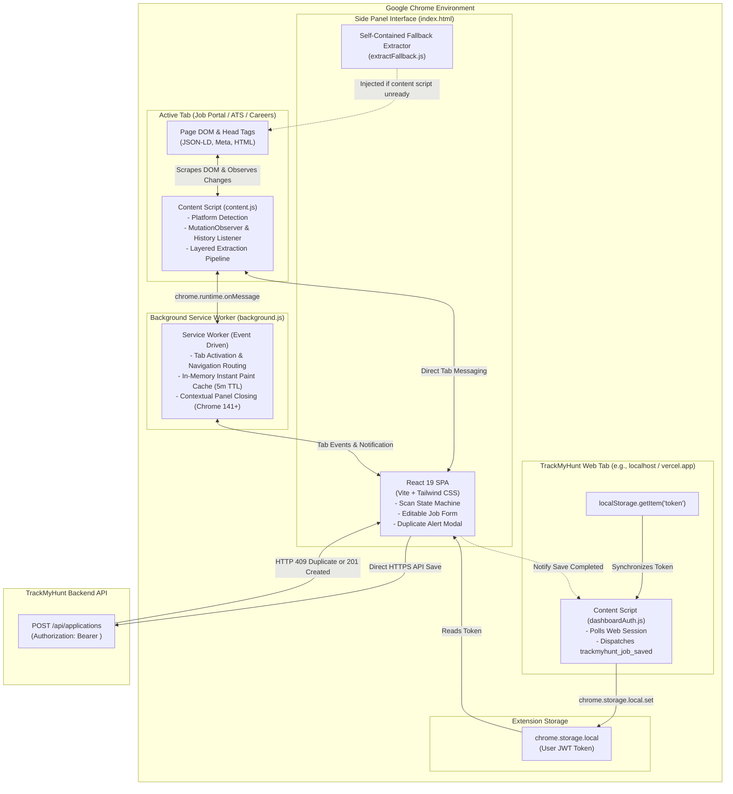
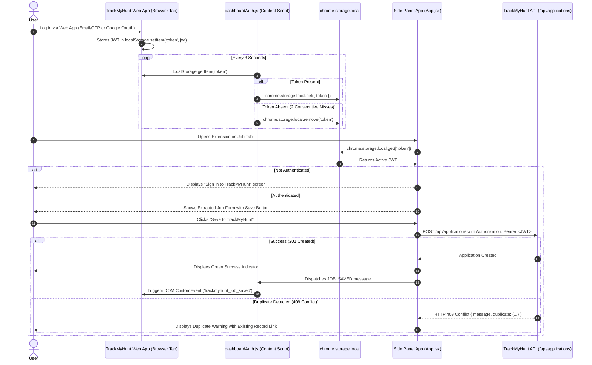

# TrackMyHunt Browser Extension

The TrackMyHunt Browser Extension is an open-source productivity companion built on Chrome Manifest V3. It enables candidates to capture job postings directly from online job portals, applicant tracking systems (ATS), and company career sites into their TrackMyHunt dashboard with a single click, eliminating manual data entry and preventing duplicate applications.

---

## 1. Overview

### What It Does
When browsing job postings across job boards or corporate portals, the extension side panel automatically inspects the active browser tab, parses structured metadata, extracts key job attributes, and normalizes the information into a unified application schema. Users can review, adjust, and immediately save the opportunity to their TrackMyHunt workspace without navigating away from the job posting.

### Key Capabilities
- **Side Panel Interface**: Utilizes Chrome's native Side Panel API (`chrome.sidePanel`) to stay alongside active job listings without obscuring page content or requiring popup re-opens.
- **Layered Multi-Tier Scraping**: Cascades through JSON-LD structured schemas, tailored platform extractors, OpenGraph/Twitter meta tags, and DOM heuristics.
- **Listing Page Guard**: Intelligently identifies search result pages, career index directories, and non-job pages to prevent accidental saves of non-job content.
- **Seamless Session Sync**: Detects authenticated TrackMyHunt web dashboard tabs and synchronizes JWT session tokens securely into extension local storage without manual extension logins or stored passwords.
- **Duplicate Detection Alerts**: Directly communicates with the TrackMyHunt backend to notify users if a job with the same URL or company/role combination has already been saved.
- **Real-Time SPA Navigation Tracking**: Listens for dynamic Single Page Application (SPA) DOM shifts and URL mutations (such as switching job cards on LinkedIn or Indeed) to re-extract without full page reloads.

---

## 2. Architecture & Manifest V3 Design

The extension strictly adheres to Chrome's Manifest V3 standard, decoupling background lifecycle events from persistent side panel rendering and DOM-isolated content scripts:



### Manifest Component Roles
1. **Side Panel (`index.html` / `src/App.jsx`)**: The interactive user interface built with React 19 and Tailwind CSS. It manages the form state machine (`scanning`, `ready`, `empty`, `unsupported`, `conn-error`), exposes editable fields, and surfaces extraction confidence indicators.
2. **Background Service Worker (`src/background/background.js`)**: An ephemeral background worker that routes tab transition events, sets default side panel behavior (`openPanelOnActionClick: true`), maintains a 5-minute memory cache of parsed tabs for instant UI painting, and cleans up state on tab switches.
3. **Job Content Script (`src/content/content.js`)**: Injected into all URLs (`<all_urls>`). Listens for extraction commands from the side panel, runs the extraction pipeline against live DOM elements, and tracks client-side SPA navigations via `MutationObserver` and History API patches.
4. **Dashboard Auth Content Script (`src/content/dashboardAuth.js`)**: Restrictively injected only into TrackMyHunt web app origins (`localhost:5173`, `localhost`, `127.0.0.1`, and production Vercel domains). Synchronizes the web application's `localStorage` JWT token into `chrome.storage.local`.

---

## 3. Multi-Tier Extraction Engine

The core extraction pipeline (`src/content/extract/pipeline.js`) processes the active document through a multi-tier priority sequence. Fields are resolved using a **first non-empty value wins** rule based on tier reliability:

```mermaid
flowchart TD
    Start([extractJob Triggered]) --> DetectPlatform[detectPlatform: URL Regex & DOM Signals]
    
    subgraph ExtractionLayers["Cascading Extraction Layers"]
        L1["Tier 1: Structured Data (JSON-LD JobPosting schema)\nConfidence: 0.95"]
        L2["Tier 2: Platform-Specific Scrapers (Domain Selectors)\nConfidence: 0.85"]
        L3["Tier 3: Meta & OpenGraph Tags (og:title, og:description)\nConfidence: 0.60"]
        L4["Tier 4: DOM Heuristic Analysis (Headings, Microdata, Semantic Tags)\nConfidence: 0.50"]
    end

    DetectPlatform --> ExtractionLayers
    ExtractionLayers --> Merge[mergePartials: First Non-Empty Value Wins per Field]
    
    subgraph Normalization["Normalization & Guards"]
        Clean[cleanCompany & cleanRole]
        LocNorm[normalizeLocation]
        TypeNorm[normalizeEmploymentType: Intern | Full-Time | Remote | Freelance | Other]
        ModeNorm[normalizeWorkMode: Remote | Hybrid | On-site]
        UrlNorm[canonicalJobUrl: Drop tracking query parameters]
        Guard{looksLikeListingPage?}
    end

    Merge --> Clean
    Clean --> LocNorm
    LocNorm --> TypeNorm
    TypeNorm --> ModeNorm
    ModeNorm --> UrlNorm
    UrlNorm --> Guard

    Guard -->|True (Directory or Multi-Card Index)| SetFlag[Flag isListingPage: true (Prevent Save)]
    Guard -->|False (Single Posting)| Ready[Return Normalized JobData with Confidence Scores]
    SetFlag --> Ready
```

### Extraction Tiers Explained
1. **Tier 1: Structured Data (`src/content/extract/structuredData.js`)**:
   Searches `<script type="application/ld+json">` blocks for Schema.org `JobPosting` objects. Extracts title, hiring organization, employment type, job location, base salary, and valid through dates. Highest confidence (`0.95`).
2. **Tier 2: Platform-Specific Scrapers (`src/content/scrapers/`)**:
   Targeted CSS and XPath selectors tailored to specific DOM structures of major recruitment platforms and applicant tracking systems.
3. **Tier 3: Meta Tags (`src/content/extract/meta.js`)**:
   Inspects OpenGraph (`og:title`, `og:description`), Twitter cards, and canonical URL elements. Title-splitting logic separates roles and company names formatted as `Role at Company` or `Role | Company`. Site names (e.g., "LinkedIn", "Indeed") are blocked from being mistakenly assigned as employer names.
4. **Tier 4: DOM Heuristics (`src/content/extract/heuristics.js`)**:
   Generic fallback that searches for semantic containers, primary `<h1>` headings, definition lists, and labeled metadata clusters.

### Listing Page Guard
A specialized verification check (`looksLikeListingPage`) evaluates page structure to protect against capturing job board homepages, search result lists, or department directories as single jobs. It counts repeating job link patterns, search bar elements, and pagination controls. If flagged, the side panel displays an informational warning asking the user to click into a specific job posting.

---

## 4. Platform Coverage & Support

| Platform / Portal | Identifier | Detection Mechanism | Specific Elements Handled |
|---|---|---|---|
| **LinkedIn** | `linkedin` | `linkedin.com/jobs` | Job search results list with active selection, unified top card, company title stripping, `currentJobId` tracking |
| **Indeed** | `indeed` | `indeed.com` | Job view headers, company overview links, salary snippets, job search detail panes |
| **Naukri** | `naukri` | `naukri.com` | Primary role headings, company link tags, experience badges, salary indicators |
| **Internshala** | `internshala` | `internshala.com` | Internship and job detail cards, stipend containers, duration badges |
| **Greenhouse** | `greenhouse` | `greenhouse.io` | Embedded application boards, `#header .company-name`, `.app-title` |
| **Lever** | `lever` | `lever.co` | Posting headers, `.posting-headline`, `.posting-categories` (location, team, commitment) |
| **Workday** | `workday` | `myworkdayjobs.com`, `workdayjobs.com` | Dynamic client-rendered job titles, hiring organization badges, location pins |
| **Ashby** | `ashby` | `ashbyhq.com` | Dynamic SPA job overview headers, URL organization slug humanization fallback |
| **Wellfound** | `wellfound` | `wellfound.com` | Startup overview cards, compensation ranges, remote work tags |
| **Google Forms** | `google_forms` | `docs.google.com/forms`, `forms.gle` | Form title extraction (leaves company/role editable for manual input on open recruitment forms) |
| **Company Careers** | `company_careers` | Path containing `/careers`, `/jobs`, `/openings` | Fallback heuristic engine + JSON-LD evaluation |
| **Generic Web Page** | `generic` | `<all_urls>` fallback | Generic heading, article body, meta tags, and structured data parsing |

---

## 5. Authentication & Token Synchronization

The extension operates with zero stored user passwords or third-party API keys:



### Security Highlights
- **No Embedded Secrets**: The extension contains no API private keys, database credentials, or secret signing keys.
- **Strict Bearer Authorization**: Saves are executed strictly through authenticated REST calls using the user's standard JWT session token.
- **Automatic Logout Sync**: Logging out of the TrackMyHunt web app clears `localStorage`, which automatically evicts the token from `chrome.storage.local` within 6 seconds via the consecutive-miss guard.

---

## 6. Development & Build Setup

### Prerequisites
- Node.js `18.x` or higher
- npm `9.x` or higher
- Google Chrome version `116` or higher (supports `chrome.sidePanel`)

### 1. Installation
Clone the repository and install dependencies inside the `extension` folder:
```bash
cd extension
npm install
```

### 2. Environment Configuration
Create an `.env` file in the `extension/` directory (refer to the defaults below):
```env
# URL of your TrackMyHunt backend API
VITE_BASE_BACKEND_URL=http://localhost:5000

# URL of your TrackMyHunt web dashboard (used for session sync)
VITE_BASE_FRONTEND_URL=http://localhost:5173
```

### 3. Build the Extension
Compile the React application and Manifest V3 bundle using Vite and `@crxjs/vite-plugin`:
```bash
npm run build
```
This produces the distribution output in `extension/dist/`.

### 4. Load Unpacked in Google Chrome
1. Open Google Chrome and enter `chrome://extensions/` in the address bar.
2. Toggle on **Developer mode** in the upper-right corner.
3. Click the **Load unpacked** button.
4. Select the `extension/dist` directory.
5. Click the extension puzzle icon in Chrome and pin **TrackMyHunt**.
6. Open any supported job portal (e.g., LinkedIn Jobs) and click the extension icon to launch the side panel.

---

## 7. Testing & Quality Assurance

### Offline Extractor Testing
The extension includes offline unit tests verifying extraction integrity against synthetic DOM trees without requiring live browser instances or external network connections:
```bash
npm test
```
- Tests are executed with the native Node.js test runner: `node --test ./test/linkedin.test.mjs`.
- The test harness leverages `test/fakeDom.mjs` to construct synthetic LinkedIn search results lists, detail cards, and missing-attribute scenarios.

### Code Linting
Run static analysis with oxlint:
```bash
npm run lint
```

---

## 8. Permissions & Chrome Manifest Details

The extension requests only the minimum necessary permissions required for side-panel operation and in-tab DOM extraction:

| Permission | Justification |
|---|---|
| `sidePanel` | Provides the side-panel user interface alongside active web pages. |
| `activeTab` | Grants temporary read access to the currently focused tab when the user opens the side panel. |
| `storage` | Stores user session tokens (`chrome.storage.local`) and user preferences. |
| `scripting` | Executes fallback in-memory extraction on tabs opened prior to extension installation. |
| `tabs` | Detects tab activation and URL changes to trigger debounced re-scans. |
| `host_permissions` | Allows content scripts to run across recruitment sites (`https://*.linkedin.com/*`, `https://*.indeed.com/*`, etc.) and permits network calls to the configured backend API. |
